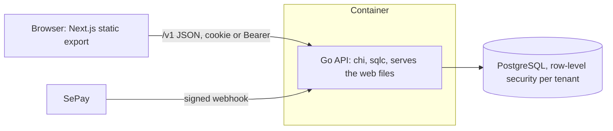
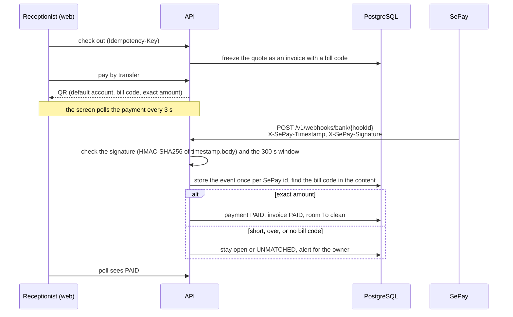

# StayGuard

Anti-loss management for small guesthouses, built as a portfolio project. A receptionist checks guests in and out on a phone; the server prices every stay, a QR code pays the owner's own bank account, and the owner sees the money, the alerts and an append-only activity log.

> Demo data only. Do not enter real guest data.

## What it does

- **Pricing by the server:** hourly, overnight and daily rates with a grace period; the web app never calculates a price (`api/internal/domain/pricing`, checked against `contracts/pricing/golden-cases.json`).
- **QR payments to the owner's account:** the QR carries the bill code and the exact amount of the tenant's default, SePay-connected account. A transfer becomes paid only when the bank reports it.
- **Roles and building access:** owner, manager, receptionist, housekeeping; per-building VIEW or EDIT; PIN sign-in with lockout.
- **Shift cash reconciliation:** the drawer is counted per note value and compared with the system's expected cash; a shortage needs a reason and alerts the owner.
- **Owner monitoring:** overview, transactions, alerts that close themselves when fixed, shift review, activity log.
- **Guest ID privacy:** optional, encrypted, write-only for the front desk, readable by owner and manager through audited endpoints.
- Vietnamese and English.

## Architecture



- **API** (`api/`): Go, `domain` (pure rules) → `app` (use cases) → `adapter` (HTTP, Postgres, crypto). The OpenAPI file `contracts/openapi.yaml` is the source of truth; server stubs, sqlc and the web client are generated from it.
- **Database:** PostgreSQL with row-level security on every tenant table; the app connects as a role that cannot bypass it. Migrations are forward-only goose files.
- **Web** (`web/`): Next.js static export, shadcn/ui, generated API client and mocks. The Go server serves the export, so one container runs the whole app.

## The SePay flow



Only incoming transfers to the guesthouse's own account settle a bill. The same delivery twice counts once. The owner can link an unmatched transfer of the exact amount to an invoice.

## The nine strict rules

1. Money is whole VND (`money.Vnd`), never a float.
2. Prices come from `domain/pricing`; no handler or web code computes one.
3. Check-in, check-out and payment times come from the server clock.
4. A transfer becomes PAID only through the payment-event handler (SePay webhook, the demo simulator, or the owner linking a bank-reported event). No UI or endpoint marks a transfer paid by hand.
5. The QR always pays the tenant's default, SePay-connected account; no request field can change it.
6. Every query is tenant-scoped; RLS is never weakened and the unit of work is never bypassed.
7. Writes that create stays, invoices, payments or other money records keep their `Idempotency-Key`.
8. Guest ID number and photos are optional, encrypted, write-only for front desk and housekeeping, readable only by owner and manager through audited endpoints, and never logged.
9. PINs, secrets, account numbers and QR payloads never appear in logs, errors or fixtures.

## Run it locally

Needs Docker (Compose v2), Go (see `api/go.mod`), Node.js 24 with npm, `openssl` and `python3`.

**A full demo guesthouse** (own compose project and port, real PIN sign-in, a worked day of data):

```bash
make demo-reset      # prints http://localhost:18200/vi/ and the sign-in codes and PINs
```

What it creates: `docs/runbooks/demo.md`. The walkthrough: `docs/demo-script.md`.

**The role-picker demo** (every visitor gets a trial tenant; the QR screen has a payment simulator):

```bash
make deploy/.env.local
docker compose --env-file deploy/.env.local -f deploy/compose.yaml -f deploy/compose.demo.override.yaml up --build -d
DATABASE_URL='postgres://stayguard@localhost:5432/stayguard?sslmode=disable' make migrate
# open http://localhost:8080/vi and pick a role
```

If port 5432 is taken, set `DB_HOST_PORT` for both commands. Check which database `DATABASE_URL` points at before `make migrate`.

**The web app alone, on mocks** (no API, no database):

```bash
cd web && npm ci && NEXT_PUBLIC_MOCK=1 npm run dev     # http://localhost:3000/vi
```

## Test it

| What | Command |
| --- | --- |
| API unit tests | `make test-api` |
| API integration tests (Docker, Testcontainers) | `make test-api-int` |
| Web unit tests | `make test-web` |
| Lint and format | `make lint`, `make fmt` |
| Contract checks (Spectral, oasdiff, schemas, pricing vectors) | `make contracts` |
| Money-path smoke test (own stack and port 18080) | `cd web && npm ci && npx playwright install chromium`, then `make smoke` |
| Rehearsal checklist against a production-like stack | `make rehearse-test` (`docs/rehearsal/README.md`) |
| Everything the demo must pass, one PASS/FAIL table | `make demo-check` |

After a contract change run `make gen` in the same commit; generated files are committed.

## Where to read next

`docs/README.md` (reading order per role), `CLAUDE.md` (working rules), `deploy/README.md` (production and backups), `docs/runbooks/` (SePay handover, demo). Product rules: `docs/15-production-design-spec.md`.

## Licence

Apache-2.0 (see ADR-002).
