<div align="center">

# StayGuard: Open-Source Property Management System (PMS) for Small Hotels & Guesthouses

**A lightweight, self-hosted hotel PMS with anti-loss controls and VietQR / SePay bank-transfer payments.**
The server prices every stay, a QR code pays the owner's own bank account, and the owner sees the money, the alerts and an append-only activity log.

[](https://github.com/pcaokhai/stayguard/actions/workflows/ci.yml)
[](LICENSE)


**English** · [Tiếng Việt](README.vi.md)

</div>

> [!NOTE]
> StayGuard is a **production-grade** open-source foundation. It is fully functional and ready for deployment, but we recommend customizing it to fit your specific business rules and completing a standard security review (see [SECURITY.md](SECURITY.md)) before processing real guest data.

## Table of contents

- [Why StayGuard](#why-stayguard)
- [Released features](#released-features)
- [Architecture](#architecture)
- [How a payment settles](#how-a-payment-settles)
- [Strict rules](#strict-rules)
- [Quick start](#quick-start)
- [Guide: run the stack against SePay Test mode](#guide-run-the-stack-against-sepay-test-mode)
- [Testing](#testing)
- [Production deploy](#production-deploy)
- [Repository layout](#repository-layout)
- [Contributing](#contributing)
- [Security](#security) · [License](#license)

## What is StayGuard?

StayGuard is an open-source **property management system (PMS)** for small guesthouses, motels, mini-hotels and hourly-rate lodging, built with Go, PostgreSQL and Next.js. It covers the front-desk core of a PMS: room map, check-in/check-out, hourly / overnight / daily rate plans, invoices, shift cash reconciliation and housekeeping. On top of that it adds the back-office basics a small owner needs: stock, staff roster and leave, payroll, expenses and an income-vs-cost report.

It is **not** a full ERP: there is no general ledger, purchasing, or CRM. It is also not a channel manager or booking engine (no OTA sync). The focus is a fast front desk and a business owner who can trust the numbers.

**Good fit:** nhà nghỉ, guesthouses, motels, mini-hotels, short-stay and hourly lodging, especially in Vietnam (VietQR, SePay, Vietnamese and English UI).

## Screenshots

### Receptionist (Front Desk)
<div align="center">
  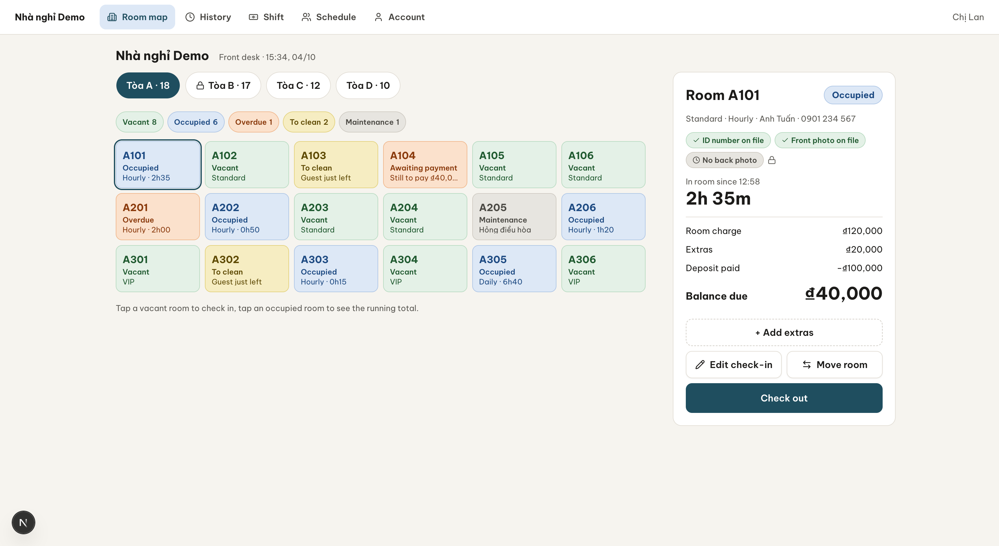
  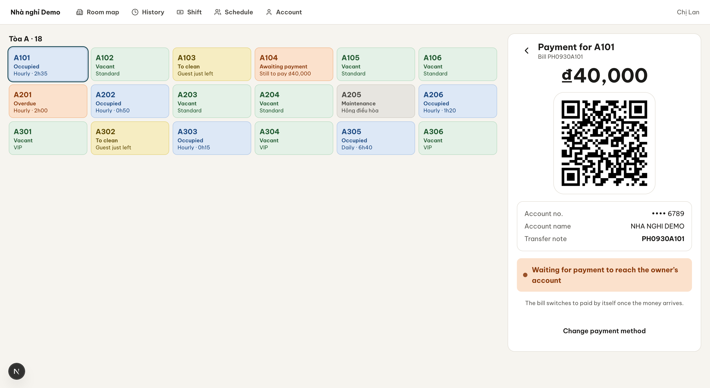
  <br>
  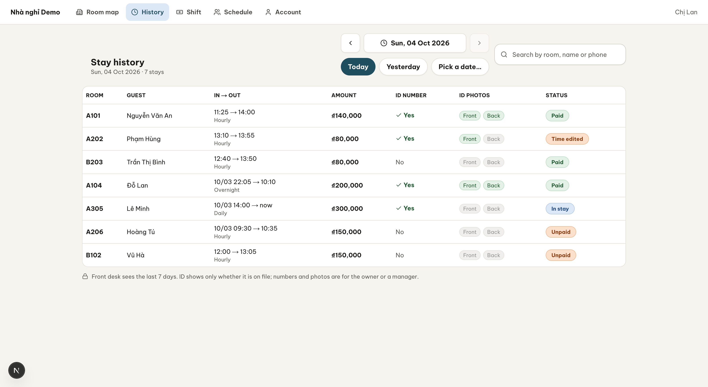
  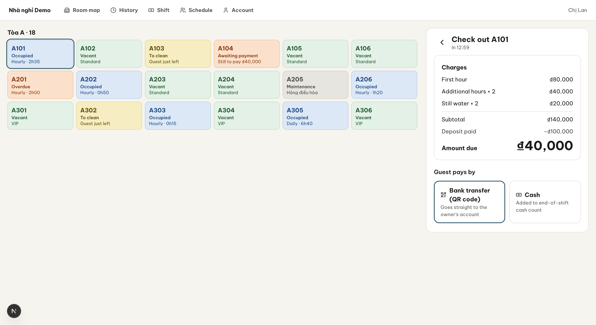
</div>

### Owner & Manager Dashboard
<div align="center">
  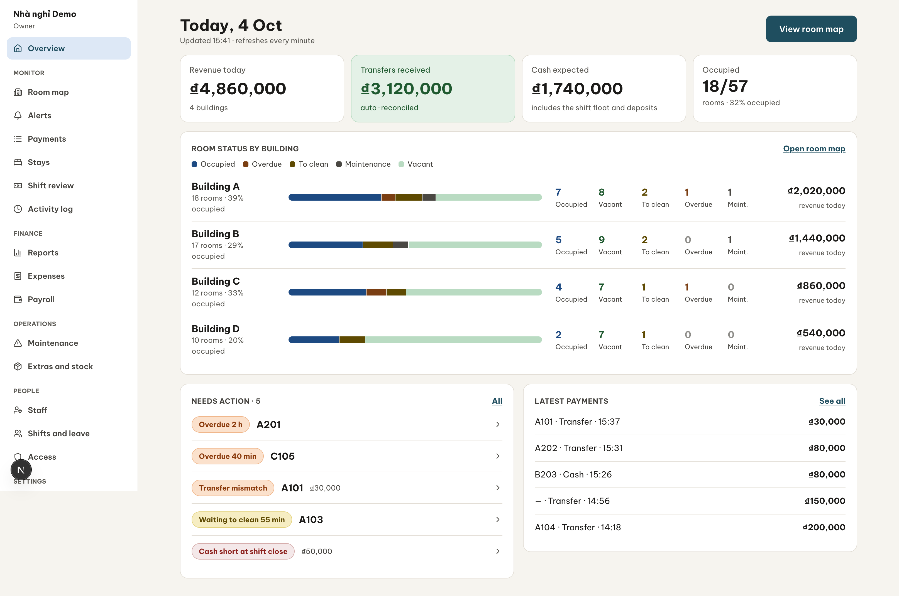
  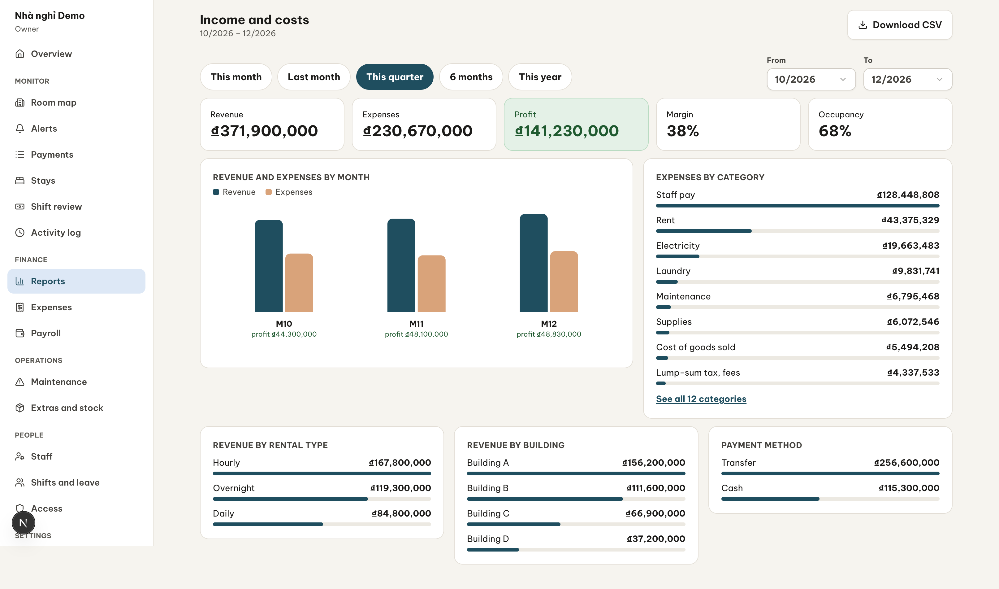
  <br>
  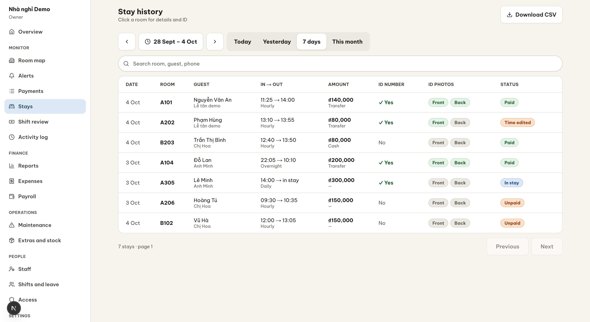
  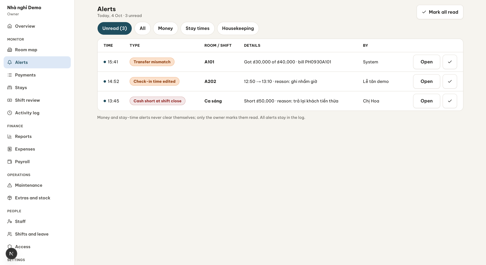
</div>

## Why StayGuard

Small guesthouses lose money in quiet ways: a room rented for two hours and logged as one, a transfer "received" that never arrived, a cash drawer that is short at shift end. StayGuard removes the places where those losses hide:

- **Prices are never typed or computed on the phone.** The server calculates every stay.
- **A transfer is "paid" only when the bank says so**, through a signed SePay webhook.
- **Every sensitive action leaves a trace** the owner can read but nobody can edit.

## Released features

Contract `contracts/openapi.yaml` **1.1.0**. Everything below is merged to `main` and covered by the rehearsal suite (109 of 146 checklist cases automated, see [`docs/rehearsal/coverage.md`](docs/rehearsal/coverage.md)).

### Front desk

| Feature | Details |
| --- | --- |
| **Room maps** | Per-building maps with live status counters (vacant, occupied, to clean, maintenance); phone, tablet and desktop layouts. |
| **Stays** | Check-in, add extras, edit check-in time (audited, re-priced by the server), move room, check-out, history, 80 mm receipts, stay timeline. |
| **Server-side pricing** | Hourly, overnight and daily rates with a grace period. Pure `domain/pricing`, verified against shared golden cases (`contracts/pricing`). |
| **QR payments** | Bill code plus exact amount, always to the tenant's default SePay-connected account. Screen polls every 3 s and flips to **Paid** by itself. |
| **Mismatch handling** | Short, over or code-less transfers keep the stay open or become *Unmatched* and alert the owner. Duplicate deliveries count once. |
| **Shifts and cash** | Drawer counted per note value, expected cash = float + cash taken − payouts, a shortage needs a reason and alerts the owner, closed shifts are locked. |
| **Cleaning** | Any role with EDIT access completes cleaning; damage reports can lock a room; maintenance tickets. |

### Owner and manager

| Feature | Details |
| --- | --- |
| **Monitoring** | Overview per building, transaction list, alerts that close themselves once fixed, shift review, append-only activity log. |
| **Link unmatched transfers** | Owner links a bank-reported event to an invoice of the exact amount, once, through the normal settlement path. |
| **People and permissions** | Roles OWNER / MANAGER / RECEPTIONIST / HOUSEKEEPING, per-building VIEW or EDIT, one-time PINs (24 h), lock and remove staff. |
| **Setup** | Buildings, floors, rooms, rate plans with live price preview, extras and stock, multiple bank accounts (one default). |
| **Stock** | Opening and restock movements, stocktake with discrepancy alerts, 7-day sales. |
| **Roster and leave** | Weekly roster, copy week, leave requests with approve/decline, staff see "my schedule". |
| **Finance** | Payroll per pay type, expenses (automatic lines from payroll, maintenance and stock), monthly recurring costs, income vs. cost report with charts. |
| **Maintenance** | Tickets with costs; finishing a ticket unlocks the room and posts the expense. |

### Security and privacy

- PIN sign-in with lockout (5 wrong PINs → 15 min) and rate limits per address and per guesthouse code.
- **Guest ID** (number and photos): optional, consent required, encrypted, write-only for front desk and housekeeping, readable by owner and manager only through audited endpoints, retention job, never logged.
- PostgreSQL **row-level security** on every tenant table; the app role cannot bypass it.
- Secrets (SePay secret, bank accounts, ID data) encrypted with `DATA_ENCRYPTION_KEY`; the server refuses to boot against a different key.
- Vietnamese and English UI (`/vi`, `/en`).

### Operations

Docker production stack with Caddy HTTPS, scheduled jobs, S3-compatible off-site backups with restore rehearsal, installer CLI (`tenant import`, `sepay webhook | set-secret | status`), and a production-like rehearsal stack with an automated checklist.

## Architecture

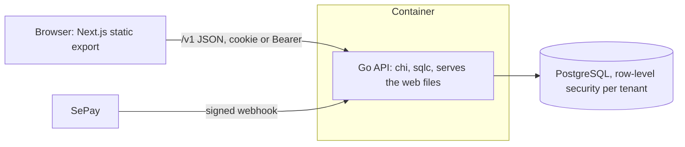

- **API** (`api/`): Go, layered `domain` (pure rules) → `app` (use cases) → `adapter` (HTTP, Postgres, crypto). `contracts/openapi.yaml` is the source of truth; server stubs, sqlc and the web client are generated from it.
- **Database:** PostgreSQL 17, forward-only goose migrations, RLS on every tenant table.
- **Web** (`web/`): Next.js static export, shadcn/ui, generated client and mocks. The Go server serves the export, so **one container runs the whole app**.

## How a payment settles

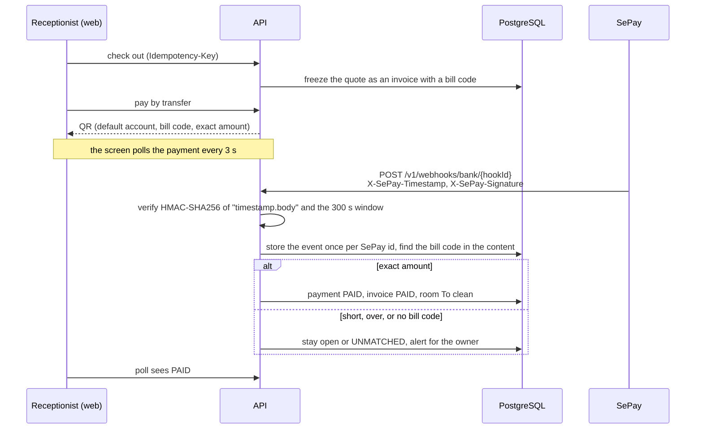

## Strict rules

These are never traded for speed (details in [`CLAUDE.md`](CLAUDE.md) §4):

1. Money is whole VND (`money.Vnd`), never a float.
2. Prices come only from `domain/pricing`.
3. Check-in, check-out and payment times come from the server clock.
4. A transfer becomes PAID only through the payment-event handler (SePay webhook, the demo simulator, or the owner linking a bank-reported event).
5. The QR always pays the tenant's default SePay-connected account.
6. Every query is tenant-scoped; RLS is never weakened.
7. Writes that create money records require `Idempotency-Key`.
8. Guest ID data is optional, consented, encrypted and audited.
9. PINs, secrets, account numbers and QR payloads never appear in logs, errors or fixtures.

## Quick start

Requires Docker (Compose v2), Go (version in `api/go.mod`), Node.js 24 + npm, `openssl`, `python3`.

```bash
git clone https://github.com/pcaokhai/stayguard.git && cd stayguard

# 1. A full demo guesthouse with real PIN sign-in and a worked day of data
make demo-reset          # prints http://localhost:18200/vi/ plus sign-in codes and PINs

# 2. Or the web app alone on mocks (no API, no database)
cd web && npm ci && NEXT_PUBLIC_MOCK=1 npm run dev     # http://localhost:3000/vi
```

Demo walkthrough: [`docs/demo-script.md`](docs/demo-script.md). Demo data: [`docs/runbooks/demo.md`](docs/runbooks/demo.md).

## Guide: run the stack against SePay Test mode

Goal: a real SePay Test-mode transaction reaches **your laptop** and turns a QR payment to **Paid**. About 20 minutes, no VPS, no real money.

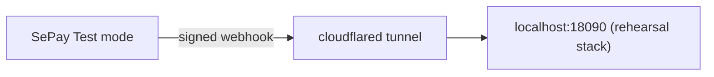

### 0. Prerequisites

- Docker (Compose v2), `python3`, `openssl`
- [`cloudflared`](https://developers.cloudflare.com/cloudflare-one/connections/connect-networks/downloads/) (`brew install cloudflared`)
- A [SePay](https://sepay.vn) account with a bank account linked and **Test mode** available

### 1. Start the stack with your SePay receiving account

The QR pays the account stored in the tenant, so give the rehearsal your SePay-linked account up front:

```bash
REHEARSE_BANK_BIN=970436 \
REHEARSE_ACCOUNT_NO=<your SePay account number> \
REHEARSE_ACCOUNT_NAME="<ACCOUNT HOLDER IN CAPS>" \
make rehearse
```

`REHEARSE_BANK_BIN` is the bank's BIN (970436 = Vietcombank). The first build takes a few minutes. When it finishes it prints **once**:

```
App (local)        http://localhost:18090/vi/
Guesthouse code    rehearse
Owner              user: owner   one-time PIN: ******
Receptionist       user: linh    one-time PIN: ******
SePay webhook path /v1/webhooks/bank/<hookId>
Secret in SePay    <random secret>
```

Copy the PINs, the webhook path and the secret now; they are not shown again. To use a secret you already created in SePay, run with `SEPAY_SECRET=<yours>`.

### 2. Open a public tunnel

```bash
cloudflared tunnel --url http://localhost:18090
```

It prints `https://<random>.trycloudflare.com`. Keep this terminal open. The address changes every time you restart the tunnel, so update the SePay webhook when it does.

### 3. Create the webhook in SePay

In the SePay dashboard, add a webhook (menu names can differ slightly between versions):

| Field | Value |
| --- | --- |
| URL | `https://<random>.trycloudflare.com` + the printed webhook path |
| Event | Incoming transactions (money in) |
| Account | The account you passed in step 1 |
| Authentication | **HMAC-SHA256** with the printed secret |

Check the connection from the server side:

```bash
docker compose -p stayguard-rehearse \
  -f deploy/compose.prod.yaml -f deploy/compose.rehearse.yaml \
  --env-file deploy/.env.rehearse run --rm api sepay status --tenant rehearse
```

### 4. Make a payment

1. Open `http://localhost:18090/vi/` and sign in as `linh` (guesthouse code `rehearse`). The first sign-in asks for a new PIN.
2. Check a guest in, then check out and choose **pay by transfer**. A QR with the bill code and exact amount appears.
3. In SePay Test mode, simulate an incoming transaction to your account with **the exact amount** and the **bill code in the transfer content**.
4. Within seconds the QR screen shows **Paid** and the room moves to *To clean*.

### 5. Try the failure paths

| Simulate in SePay | Expected result |
| --- | --- |
| Amount lower or higher than the bill | Stay stays open; alert for the owner |
| Content without the bill code | Event becomes *Unmatched*; sign in as `owner`, open transactions and link it to an invoice of the exact amount |
| Same delivery twice | Counted once (deduplicated on SePay's transaction id) |

### 6. Troubleshooting

| Symptom | Fix |
| --- | --- |
| Nothing arrives | Open the tunnel URL + `/readyz` in a browser; check the SePay webhook log for the HTTP status |
| Signature rejected | The secret in SePay must equal the printed one. Re-set it: `docker compose … exec api sepay set-secret --tenant rehearse` (hidden prompt) |
| `sepay webhook rejected: timestamp outside tolerance` | Fix the machine clock (NTP). Widen only if needed: `SEPAY_TIMESTAMP_TOLERANCE=900s` |
| QR never turns Paid but webhook returns 200 | The amount or bill code did not match; look at the owner's transactions list |
| `key fingerprint mismatch` | You mixed a data volume with a different `DATA_ENCRYPTION_KEY`. Run `make rehearse-down` and start clean |
| Port in use | `REHEARSE_PORT=18095 make rehearse` |

### 7. Clean up

```bash
make rehearse-down      # removes containers, volumes, secrets file and local dumps
```

> [!TIP]
> No SePay account yet? `make rehearse-test` runs the whole payment checklist with **locally signed** webhooks, no tunnel and no tokens ([`docs/rehearsal/README.md`](docs/rehearsal/README.md)).

Going to production with a real guesthouse? Follow [`docs/runbooks/sepay-handover.md`](docs/runbooks/sepay-handover.md): the owner creates the SePay account in their own name, the secret is typed into a hidden prompt, and a single real 2,000 đ transfer proves the path.

## Testing

| What | Command |
| --- | --- |
| API unit tests | `make test-api` |
| API integration tests (Docker, Testcontainers) | `make test-api-int` |
| Web unit tests | `make test-web` |
| Lint and format | `make lint`, `make fmt` |
| Contract checks (Spectral, oasdiff, schemas, pricing vectors) | `make contracts` |
| Money-path smoke test | `cd web && npm ci && npx playwright install chromium`, then `make smoke` |
| Production-like rehearsal checklist | `make rehearse-test` |
| Everything the demo must pass | `make demo-check` |

After a contract change run `make gen` in the same commit; generated files are committed.

## Production deploy

One VPS, Docker, Caddy for automatic HTTPS, daily off-site backups. Step-by-step: [`deploy/README.md`](deploy/README.md).

## Repository layout

```
api/        Go backend (domain → app → adapter); migrations in api/migrations
web/        Next.js static export; shadcn/ui, generated client and mocks
contracts/  openapi.yaml (source of truth), pricing vectors, fixtures
deploy/     Dockerfile, compose files, Caddyfile, backup scripts
scripts/    smoke, rehearsal, demo and CI helper scripts
docs/       product rules, UI kit, ADRs, runbooks, rehearsal evidence
```

Reading order: [`docs/README.md`](docs/README.md). Decisions: [`docs/adr/`](docs/adr).

## Keywords

open source PMS, hotel management system, guesthouse management software, motel software, mini hotel PMS, self-hosted property management, hourly hotel billing, front desk software, VietQR payment, SePay webhook integration, bank transfer reconciliation, shift cash reconciliation, multi-tenant PostgreSQL row-level security, Go chi sqlc, Next.js static export.

## Contributing

Issues and pull requests are welcome.

1. Read [`CLAUDE.md`](CLAUDE.md) (working rules and the strict list above) and the relevant service guide (`api/CLAUDE.md`, `web/CLAUDE.md`).
2. Change `contracts/openapi.yaml` first for any API change, then run `make gen`.
3. Write tests for money, pricing, permissions and RLS areas first; run `make lint` and the matching test target.
4. Commit as `feat(api|web): <summary>` or `fix(...)`. Keep pull requests small.
5. Never commit secrets, real guest data, real bank accounts or customer names.

## Security

Report vulnerabilities privately through GitHub's private vulnerability reporting (Security tab). See [SECURITY.md](SECURITY.md).

## License

[Apache-2.0](LICENSE). Third-party notices in [NOTICE](NOTICE).
