<div align="center">

# StayGuard: Phần mềm quản lý nhà nghỉ, khách sạn mini mã nguồn mở (PMS)

**Hệ thống quản lý lưu trú (PMS) gọn nhẹ, tự host, chống thất thoát, thanh toán chuyển khoản VietQR / SePay.**
Máy chủ tính giá mọi lượt ở, mã QR chuyển tiền thẳng vào tài khoản của chủ, chủ xem được tiền, cảnh báo và nhật ký hoạt động chỉ ghi thêm, không sửa được.

[](https://github.com/pcaokhai/stayguard/actions/workflows/ci.yml)
[](LICENSE)


[English](README.md) · **Tiếng Việt**

</div>

> [!NOTE]
> StayGuard là một dự án mã nguồn mở **đạt chuẩn production (production-grade)**. Hệ thống đã hoàn thiện và sẵn sàng để triển khai, tuy nhiên bạn nên tùy biến lại theo luồng nghiệp vụ (use case) cụ thể của từng khách hàng và thực hiện rà soát bảo mật tiêu chuẩn (xem [SECURITY.md](SECURITY.md)) trước khi xử lý dữ liệu khách thật.

## Mục lục

- [Vì sao có StayGuard](#vì-sao-có-stayguard)
- [Tính năng đã phát hành](#tính-năng-đã-phát-hành)
- [Kiến trúc](#kiến-trúc)
- [Một khoản thanh toán được xác nhận thế nào](#một-khoản-thanh-toán-được-xác-nhận-thế-nào)
- [Quy tắc bất di bất dịch](#quy-tắc-bất-di-bất-dịch)
- [Chạy nhanh](#chạy-nhanh)
- [Hướng dẫn: dựng stack với SePay Test mode](#hướng-dẫn-dựng-stack-với-sepay-test-mode)
- [Kiểm thử](#kiểm-thử)
- [Triển khai production](#triển-khai-production)
- [Cấu trúc repo](#cấu-trúc-repo)
- [Đóng góp](#đóng-góp)
- [Bảo mật](#bảo-mật) · [Giấy phép](#giấy-phép)

## StayGuard là gì?

StayGuard là **phần mềm quản lý nhà nghỉ, khách sạn mini (PMS - property management system)** mã nguồn mở, viết bằng Go, PostgreSQL và Next.js. Nó có phần lõi của một PMS ở quầy lễ tân: sơ đồ phòng, nhận/trả phòng, bảng giá theo giờ / qua đêm / theo ngày, hóa đơn, đối soát tiền mặt theo ca và dọn phòng. Thêm vào đó là các nghiệp vụ hậu trường cơ bản chủ nhà nghỉ cần: kho, lịch ca và nghỉ phép, bảng lương, chi phí và báo cáo thu chi.

StayGuard **không phải ERP**: không có sổ cái kế toán, mua hàng hay CRM. Nó cũng không phải channel manager hay công cụ đặt phòng (không đồng bộ OTA). Trọng tâm là quầy lễ tân nhanh và chủ nhà nghỉ tin được vào con số.

**Phù hợp với:** nhà nghỉ, nhà trọ, khách sạn mini, lưu trú ngắn hạn và tính giờ, đặc biệt tại Việt Nam (VietQR, SePay, giao diện tiếng Việt và tiếng Anh).

## Hình ảnh giao diện

### Phân hệ Lễ tân (Front Desk)
<div align="center">
  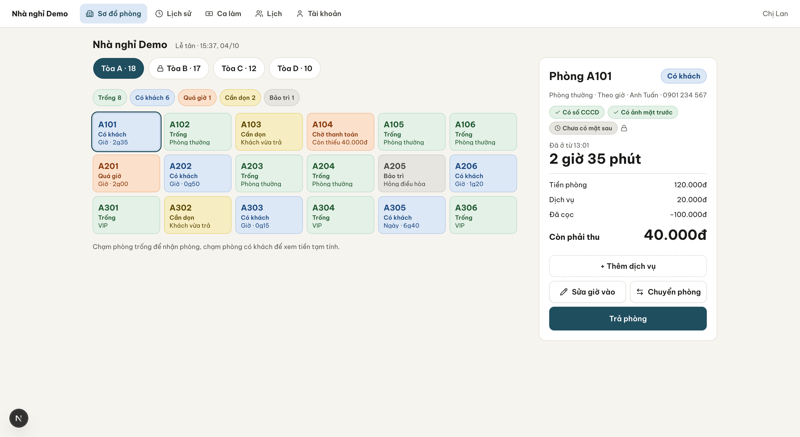
  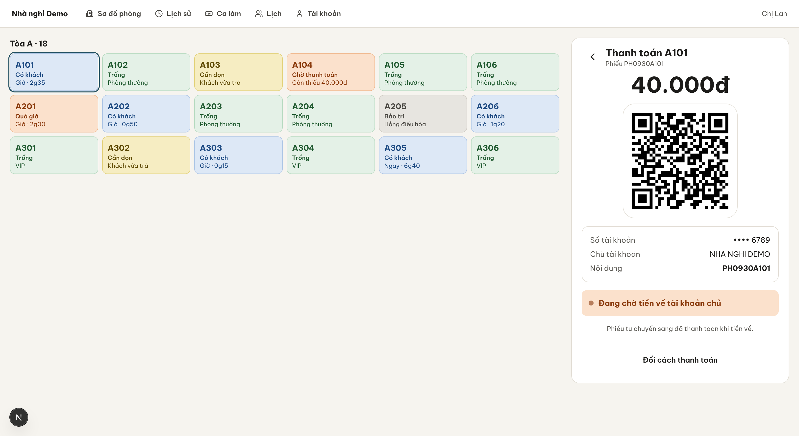
  <br>
  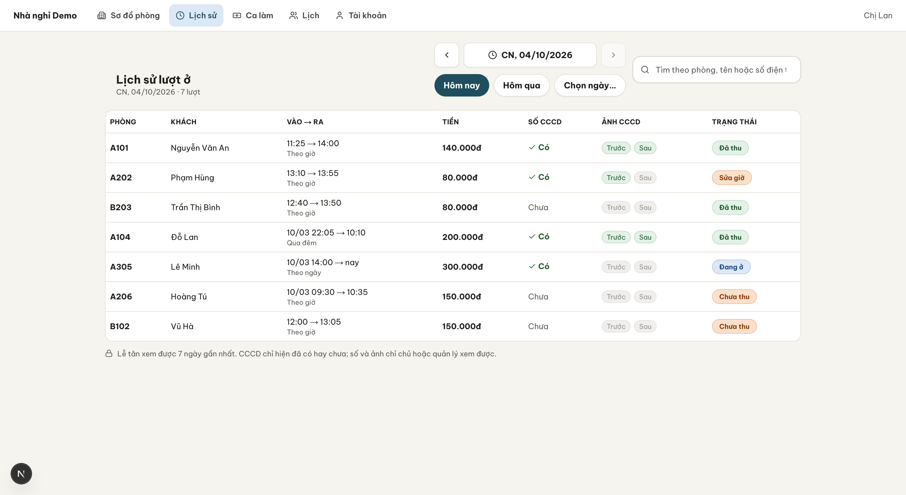
  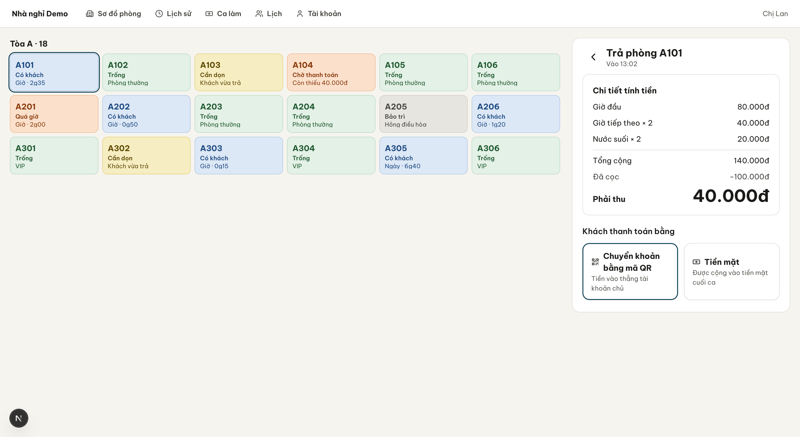
</div>

### Phân hệ Chủ & Quản lý (Owner Dashboard)
<div align="center">
  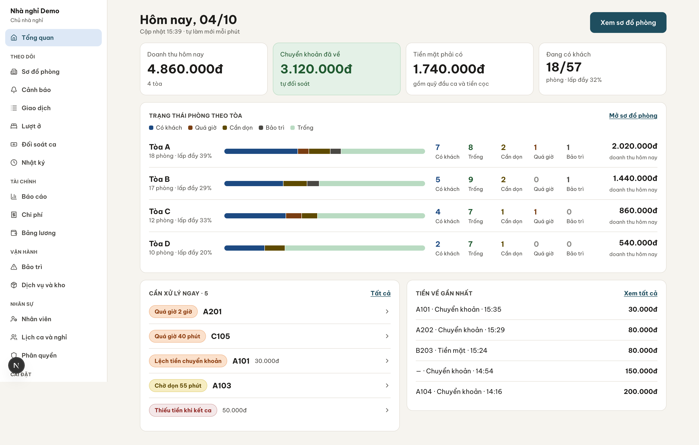
  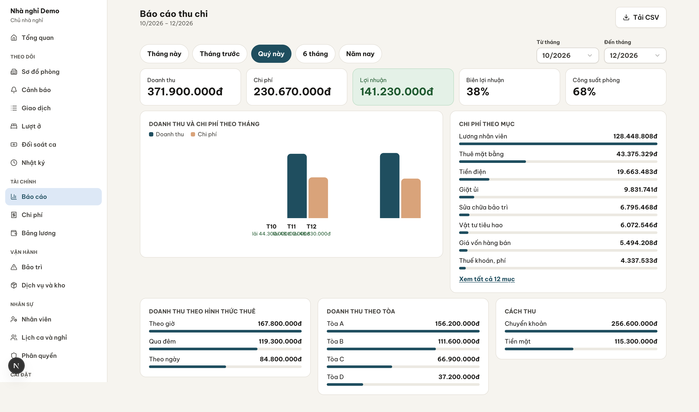
  <br>
  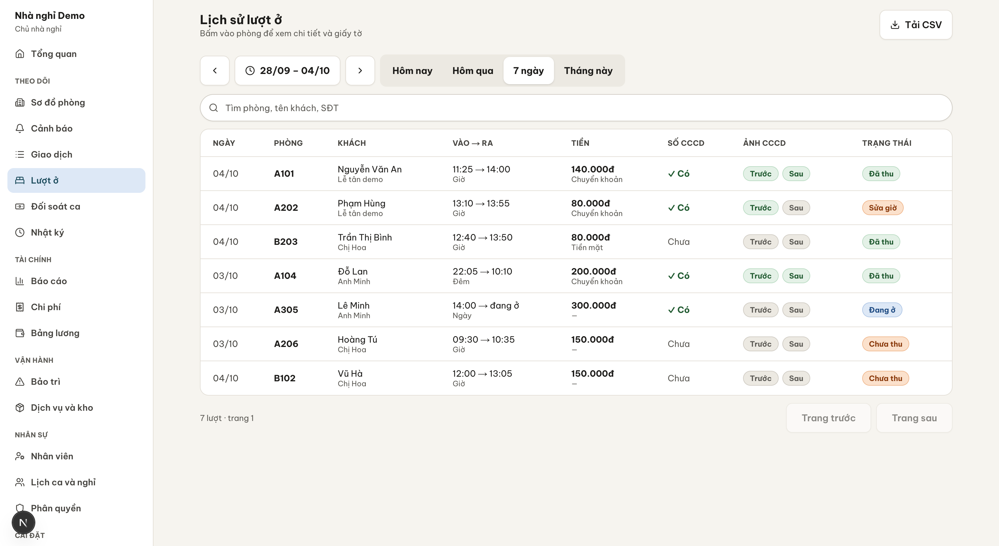
  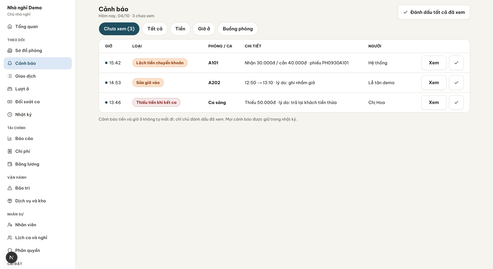
</div>

## Vì sao có StayGuard

Nhà nghỉ nhỏ thất thoát tiền theo những cách rất lặng lẽ: phòng thuê hai giờ ghi thành một giờ, khoản chuyển khoản "đã nhận" mà thực ra chưa về, két tiền hụt cuối ca. StayGuard bịt những chỗ đó:

- **Giá không bao giờ do người dùng gõ hay điện thoại tính.** Máy chủ tính mọi lượt ở.
- **Chuyển khoản chỉ "Đã thanh toán" khi ngân hàng báo về**, qua webhook SePay có chữ ký.
- **Mọi thao tác nhạy cảm đều để lại dấu vết** mà chủ đọc được, không ai sửa được.

## Tính năng đã phát hành

Hợp đồng API `contracts/openapi.yaml` **1.1.0**. Mọi mục dưới đây đã nằm trong `main` và được bộ diễn tập kiểm tra (109/146 ca trong checklist đã tự động, xem [`docs/rehearsal/coverage.md`](docs/rehearsal/coverage.md)).

### Lễ tân

| Tính năng | Chi tiết |
| --- | --- |
| **Sơ đồ phòng** | Sơ đồ theo tòa, bộ đếm trạng thái trực tiếp (trống, có khách, cần dọn, bảo trì); giao diện điện thoại, máy tính bảng, máy tính. |
| **Lượt ở** | Nhận phòng, thêm dịch vụ, sửa giờ nhận (có ghi nhật ký, máy chủ tính lại giá), chuyển phòng, trả phòng, lịch sử, biên lai 80 mm, dòng thời gian lượt ở. |
| **Tính giá ở máy chủ** | Giá theo giờ, qua đêm, theo ngày, có phút ân hạn. `domain/pricing` thuần, đối chiếu với bộ ca chuẩn chung (`contracts/pricing`). |
| **Thanh toán QR** | Mã phiếu và đúng số tiền, luôn vào tài khoản mặc định đã kết nối SePay của chủ. Màn hình hỏi lại mỗi 3 giây và tự chuyển sang **Đã thanh toán**. |
| **Xử lý chuyển khoản lệch** | Thiếu, thừa hoặc không có mã phiếu thì lượt ở giữ nguyên hoặc thành *Chưa rõ phiếu* và báo chủ. Webhook gửi trùng chỉ tính một lần. |
| **Ca và tiền mặt** | Kiểm két theo từng mệnh giá, tiền dự kiến = quỹ đầu ca + thu − chi, hụt tiền phải ghi lý do và báo chủ, ca đã chốt bị khóa. |
| **Dọn phòng** | Mọi vai trò có quyền Sửa đều xác nhận dọn xong; báo hư hỏng có thể khóa phòng; phiếu bảo trì. |

### Chủ và quản lý

| Tính năng | Chi tiết |
| --- | --- |
| **Theo dõi** | Tổng quan theo tòa, danh sách giao dịch, cảnh báo tự đóng khi đã xử lý, đối soát ca, nhật ký hoạt động chỉ ghi thêm. |
| **Gán khoản chưa rõ phiếu** | Chủ gán một khoản ngân hàng đã báo vào phiếu đúng số tiền, đúng một lần, qua đường xác nhận thanh toán chuẩn. |
| **Nhân sự và phân quyền** | Vai trò OWNER / MANAGER / RECEPTIONIST / HOUSEKEEPING, quyền Xem hoặc Sửa theo từng tòa, PIN dùng một lần (24 giờ), khóa và xóa nhân viên. |
| **Cài đặt** | Tòa, tầng, phòng, bảng giá có xem trước giá trực tiếp, dịch vụ và kho, nhiều tài khoản ngân hàng (một mặc định). |
| **Kho** | Nhập đầu kỳ và nhập thêm, kiểm kho có cảnh báo chênh lệch, bán 7 ngày gần nhất. |
| **Lịch ca và nghỉ phép** | Lịch ca tuần, sao chép tuần, xin nghỉ có duyệt hoặc từ chối, nhân viên xem "lịch của tôi". |
| **Tài chính** | Bảng lương theo từng loại lương, chi phí (tự sinh từ lương, bảo trì, nhập kho), chi phí định kỳ hằng tháng, báo cáo thu chi có biểu đồ. |
| **Bảo trì** | Phiếu kèm chi phí; hoàn tất phiếu thì mở khóa phòng và ghi chi phí. |

### Bảo mật và quyền riêng tư

- Đăng nhập bằng PIN, khóa tài khoản (sai 5 lần → khóa 15 phút), giới hạn tần suất theo địa chỉ và theo mã nhà nghỉ.
- **Giấy tờ khách** (số và ảnh): không bắt buộc, cần đồng ý của khách, mã hóa, lễ tân và buồng phòng chỉ ghi không đọc, chỉ chủ và quản lý đọc qua endpoint có ghi nhật ký, có job hết hạn lưu trữ, không bao giờ vào log.
- **Row-level security** của PostgreSQL trên mọi bảng theo tenant; vai trò của ứng dụng không vượt được.
- Bí mật (secret SePay, số tài khoản, dữ liệu giấy tờ) được mã hóa bằng `DATA_ENCRYPTION_KEY`; máy chủ từ chối khởi động nếu khóa khác.
- Giao diện tiếng Việt và tiếng Anh (`/vi`, `/en`).

### Vận hành

Stack Docker production với Caddy HTTPS, job định kỳ, sao lưu S3 ngoài máy chủ kèm diễn tập khôi phục, CLI cho người cài (`tenant import`, `sepay webhook | set-secret | status`), và stack diễn tập giống production với checklist tự động.

## Kiến trúc

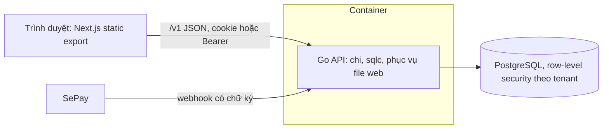

- **API** (`api/`): Go, phân lớp `domain` (luật thuần) → `app` (use case) → `adapter` (HTTP, Postgres, mã hóa). `contracts/openapi.yaml` là nguồn sự thật; server stub, sqlc và client web đều sinh từ đó.
- **CSDL:** PostgreSQL 17, migration goose chỉ đi tới, RLS trên mọi bảng tenant.
- **Web** (`web/`): Next.js static export, shadcn/ui, client và mock sinh tự động. Máy chủ Go phục vụ bản export nên **một container chạy cả ứng dụng**.

## Một khoản thanh toán được xác nhận thế nào

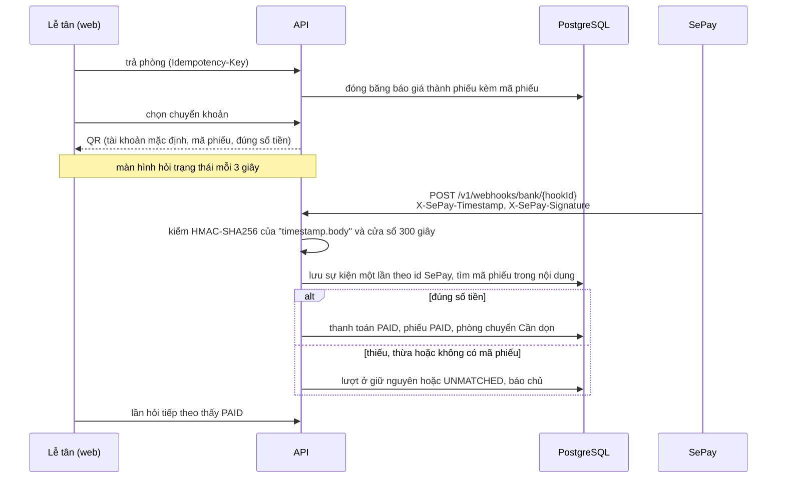

## Quy tắc bất di bất dịch

Không bao giờ đánh đổi lấy tốc độ (chi tiết ở [`CLAUDE.md`](CLAUDE.md) mục 4):

1. Tiền là số nguyên VND (`money.Vnd`), không dùng số thực.
2. Giá chỉ đến từ `domain/pricing`.
3. Giờ nhận, trả phòng và thanh toán lấy từ đồng hồ máy chủ.
4. Chuyển khoản thành PAID chỉ qua bộ xử lý sự kiện thanh toán (webhook SePay, trình giả lập demo, hoặc chủ gán một sự kiện ngân hàng đã báo).
5. QR luôn trả vào tài khoản mặc định đã kết nối SePay của tenant.
6. Mọi truy vấn đều theo tenant; không bao giờ nới RLS.
7. Thao tác ghi tạo bản ghi tiền bắt buộc có `Idempotency-Key`.
8. Dữ liệu giấy tờ khách: tùy chọn, có đồng ý, mã hóa, có nhật ký truy cập.
9. PIN, secret, số tài khoản và nội dung QR không bao giờ nằm trong log, lỗi hay fixture.

## Chạy nhanh

Cần Docker (Compose v2), Go (phiên bản trong `api/go.mod`), Node.js 24 + npm, `openssl`, `python3`.

```bash
git clone https://github.com/pcaokhai/stayguard.git && cd stayguard

# 1. Nhà nghỉ demo đầy đủ, đăng nhập PIN thật, có dữ liệu một ngày làm việc
make demo-reset          # in ra http://localhost:18200/vi/ cùng mã đăng nhập và PIN

# 2. Hoặc chỉ chạy web trên mock (không API, không CSDL)
cd web && npm ci && NEXT_PUBLIC_MOCK=1 npm run dev     # http://localhost:3000/vi
```

Kịch bản demo: [`docs/demo-script.md`](docs/demo-script.md). Dữ liệu demo: [`docs/runbooks/demo.md`](docs/runbooks/demo.md).

## Hướng dẫn: dựng stack với SePay Test mode

Mục tiêu: một giao dịch SePay Test mode thật đi tới **máy bạn** và biến thanh toán QR thành **Đã thanh toán**. Khoảng 20 phút, không cần VPS, không dùng tiền thật.

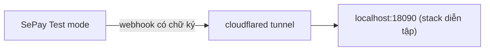

### 0. Chuẩn bị

- Docker (Compose v2), `python3`, `openssl`
- [`cloudflared`](https://developers.cloudflare.com/cloudflare-one/connections/connect-networks/downloads/) (`brew install cloudflared`)
- Tài khoản [SePay](https://sepay.vn) đã liên kết một tài khoản ngân hàng và dùng được **Test mode**

### 1. Khởi động stack với tài khoản nhận tiền SePay của bạn

QR trả vào tài khoản lưu trong tenant, nên hãy đưa tài khoản SePay vào ngay từ đầu:

```bash
REHEARSE_BANK_BIN=970436 \
REHEARSE_ACCOUNT_NO=<số tài khoản SePay của bạn> \
REHEARSE_ACCOUNT_NAME="<TÊN CHỦ TÀI KHOẢN VIẾT HOA>" \
make rehearse
```

`REHEARSE_BANK_BIN` là mã BIN ngân hàng (970436 = Vietcombank). Lần build đầu mất vài phút. Xong sẽ in **một lần duy nhất**:

```
App (local)        http://localhost:18090/vi/
Guesthouse code    rehearse
Owner              user: owner   one-time PIN: ******
Receptionist       user: linh    one-time PIN: ******
SePay webhook path /v1/webhooks/bank/<hookId>
Secret in SePay    <secret ngẫu nhiên>
```

Hãy chép ngay PIN, đường dẫn webhook và secret, vì sẽ không hiện lại. Muốn dùng secret đã tạo sẵn trong SePay, chạy kèm `SEPAY_SECRET=<secret của bạn>`.

### 2. Mở tunnel công khai

```bash
cloudflared tunnel --url http://localhost:18090
```

Lệnh in ra `https://<ngẫu-nhiên>.trycloudflare.com`. Giữ nguyên cửa sổ terminal này. Địa chỉ đổi mỗi lần chạy lại tunnel, khi đó phải cập nhật lại webhook trong SePay.

### 3. Tạo webhook trong SePay

Trong trang quản trị SePay, thêm webhook (tên menu có thể khác nhẹ giữa các phiên bản):

| Trường | Giá trị |
| --- | --- |
| URL | `https://<ngẫu-nhiên>.trycloudflare.com` + đường dẫn webhook đã in |
| Sự kiện | Giao dịch tiền vào |
| Tài khoản | Tài khoản bạn dùng ở bước 1 |
| Xác thực | **HMAC-SHA256** với secret đã in |

Kiểm tra kết nối từ phía máy chủ:

```bash
docker compose -p stayguard-rehearse \
  -f deploy/compose.prod.yaml -f deploy/compose.rehearse.yaml \
  --env-file deploy/.env.rehearse run --rm api sepay status --tenant rehearse
```

### 4. Thực hiện một thanh toán

1. Mở `http://localhost:18090/vi/`, đăng nhập `linh` (mã nhà nghỉ `rehearse`). Lần đầu sẽ yêu cầu đặt PIN mới.
2. Nhận phòng cho một khách, rồi trả phòng và chọn **chuyển khoản**. Màn hình hiện QR kèm mã phiếu và đúng số tiền.
3. Trong SePay Test mode, giả lập một giao dịch tiền vào tài khoản của bạn với **đúng số tiền** và **mã phiếu trong nội dung chuyển khoản**.
4. Vài giây sau màn hình QR hiện **Đã thanh toán**, phòng chuyển sang *Cần dọn*.

### 5. Thử các trường hợp lỗi

| Giả lập trong SePay | Kết quả mong đợi |
| --- | --- |
| Số tiền thấp hơn hoặc cao hơn phiếu | Lượt ở giữ nguyên; báo chủ |
| Nội dung không có mã phiếu | Sự kiện thành *Chưa rõ phiếu*; đăng nhập `owner`, vào giao dịch và gán vào phiếu đúng số tiền |
| Gửi trùng cùng một giao dịch | Chỉ tính một lần (khử trùng theo id giao dịch của SePay) |

### 6. Xử lý sự cố

| Triệu chứng | Cách xử lý |
| --- | --- |
| Không có gì tới | Mở địa chỉ tunnel + `/readyz` trên trình duyệt; xem nhật ký webhook của SePay để biết mã HTTP |
| Chữ ký bị từ chối | Secret trong SePay phải trùng secret đã in. Đặt lại: `docker compose … exec api sepay set-secret --tenant rehearse` (nhập ẩn) |
| `sepay webhook rejected: timestamp outside tolerance` | Chỉnh đồng hồ máy (NTP). Chỉ nới khi cần: `SEPAY_TIMESTAMP_TOLERANCE=900s` |
| Webhook trả 200 nhưng QR không sang Đã thanh toán | Số tiền hoặc mã phiếu không khớp; xem danh sách giao dịch của chủ |
| `key fingerprint mismatch` | Volume dữ liệu cũ bị trộn với `DATA_ENCRYPTION_KEY` khác. Chạy `make rehearse-down` rồi dựng lại từ đầu |
| Cổng đã bị chiếm | `REHEARSE_PORT=18095 make rehearse` |

### 7. Dọn dẹp

```bash
make rehearse-down      # xóa container, volume, file secret và bản dump cục bộ
```

> [!TIP]
> Chưa có tài khoản SePay? `make rehearse-test` chạy toàn bộ checklist thanh toán bằng webhook **ký cục bộ**, không cần tunnel hay token ([`docs/rehearsal/README.md`](docs/rehearsal/README.md)).

Đưa vào nhà nghỉ thật? Làm theo [`docs/runbooks/sepay-handover.md`](docs/runbooks/sepay-handover.md): chủ tự đăng ký SePay bằng tên mình, secret nhập qua ô ẩn, và một giao dịch thật 2.000 đ để chứng minh đường tiền chạy đúng.

## Kiểm thử

| Nội dung | Lệnh |
| --- | --- |
| Unit test API | `make test-api` |
| Integration test API (Docker, Testcontainers) | `make test-api-int` |
| Unit test web | `make test-web` |
| Lint và format | `make lint`, `make fmt` |
| Kiểm hợp đồng (Spectral, oasdiff, schema, vector giá) | `make contracts` |
| Smoke test đường tiền | `cd web && npm ci && npx playwright install chromium`, rồi `make smoke` |
| Checklist diễn tập giống production | `make rehearse-test` |
| Mọi thứ demo phải qua | `make demo-check` |

Sau khi đổi hợp đồng, chạy `make gen` trong cùng commit; file sinh tự động được commit.

## Triển khai production

Một VPS, Docker, Caddy cấp HTTPS tự động, sao lưu ngoài máy chủ hằng ngày. Từng bước: [`deploy/README.md`](deploy/README.md).

## Cấu trúc repo

```
api/        Backend Go (domain → app → adapter); migration ở api/migrations
web/        Next.js static export; shadcn/ui, client và mock sinh tự động
contracts/  openapi.yaml (nguồn sự thật), vector giá, fixture
deploy/     Dockerfile, file compose, Caddyfile, script sao lưu
scripts/    smoke, diễn tập, demo và script hỗ trợ CI
docs/       luật sản phẩm, UI kit, ADR, runbook, bằng chứng diễn tập
```

Thứ tự đọc: [`docs/README.md`](docs/README.md). Các quyết định kiến trúc: [`docs/adr/`](docs/adr).

## Từ khóa

phần mềm quản lý nhà nghỉ, phần mềm quản lý khách sạn mini, phần mềm quản lý nhà trọ, PMS mã nguồn mở, quản lý lưu trú, tính tiền phòng theo giờ, thanh toán QR VietQR, tích hợp webhook SePay, đối soát chuyển khoản, đối soát tiền mặt theo ca, PostgreSQL row-level security, Go, Next.js.

## Đóng góp

Chào đón issue và pull request.

1. Đọc [`CLAUDE.md`](CLAUDE.md) (quy tắc làm việc và danh sách bất di bất dịch ở trên) và hướng dẫn của từng service (`api/CLAUDE.md`, `web/CLAUDE.md`).
2. Mọi thay đổi API bắt đầu từ `contracts/openapi.yaml`, rồi chạy `make gen`.
3. Viết test trước cho vùng tiền, giá, phân quyền và RLS; chạy `make lint` và target test tương ứng.
4. Commit dạng `feat(api|web): <tóm tắt>` hoặc `fix(...)`. Giữ pull request nhỏ.
5. Không commit secret, dữ liệu khách thật, tài khoản ngân hàng thật hay tên khách hàng.

## Bảo mật

Báo lỗ hổng riêng tư qua tính năng báo cáo lỗ hổng riêng tư của GitHub (tab Security). Xem [SECURITY.md](SECURITY.md).

## Giấy phép

[Apache-2.0](LICENSE). Thông báo bên thứ ba ở [NOTICE](NOTICE).
