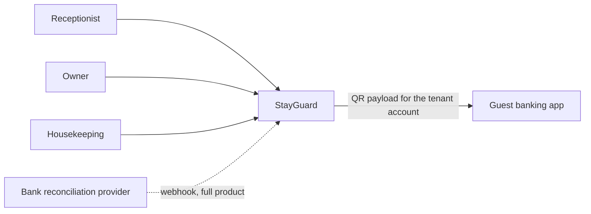
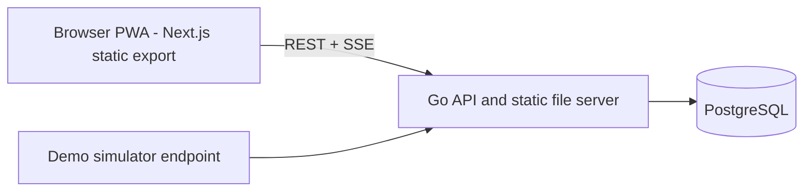
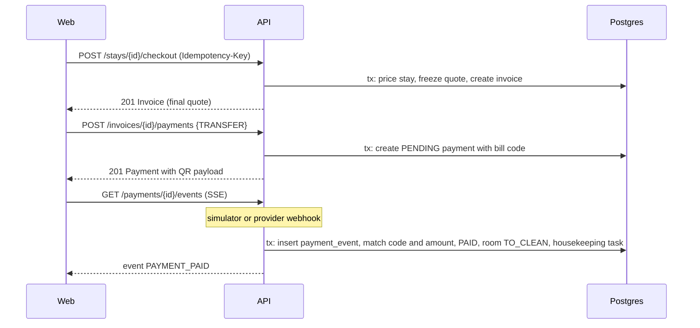

# Software Architecture Document — StayGuard

Version 1.0 · 2026-09-30 · Owner: Tech lead

Normative sources: `contracts/openapi.yaml`, `contracts/pricing/`, `contracts/events/`.

## 1. Scope

Covers the demo (v0.1.0) and the seams that let the production product grow from it. The production repository is private and adds modules; it never rewrites the core (ADR-002).

## 2. Architecture drivers

### 2.1 Functional requirements

| ID | Requirement | Epic |
| --- | --- | --- |
| FR-01 | Trial sessions by role, each with its own sample tenant expiring after 24 h | E1, E6 |
| FR-02 | Room map per building with status, elapsed time and view-only mode | E2, E5 |
| FR-03 | Check-in with hourly, overnight or daily rental; time recorded by the server | E2 |
| FR-04 | Running total that always equals the final bill at that instant | E2 |
| FR-05 | Extras with stock | E2 |
| FR-06 | Check-out producing an itemised invoice and handling the deposit | E2 |
| FR-07 | Cash and bank-transfer payment; transfer QR pays the tenant's own account | E3 |
| FR-08 | A transfer is paid only when a server-side payment event confirms it (simulated in the demo) | E3 |
| FR-09 | Housekeeping tasks and used-room reports | E4 |
| FR-10 | Owner overview with revenue, cash expected, alerts, latest payments | E4 |
| FR-11 | Owner grants none, view or edit per staff member per building | E5 |
| FR-12 | Shift close with cash count, reason on gap, owner review | E5 |
| FR-13 | Vietnamese and English throughout | E0, E6 |
| FR-14 | Append-only audit log for sensitive actions | E1 to E5 |
| FR-15 | Trial tenant creation, cloning, expiry and rate limiting | E6 |

### 2.2 Quality attribute scenarios

| ID | Attribute | Scenario | Measure |
| --- | --- | --- | --- |
| NFR-01 | Correctness | Any stay is priced | 25 of 25 golden cases and 2 error cases pass; property tests (monotonic non-decreasing, cap respected, integer output) pass 10,000 random stays; verified by SG-101 |
| NFR-02 | Isolation | Tenant A calls any endpoint with tenant B's ids | Always 404; isolation suite runs every operationId with two tenants; SG-003 and SG-604 |
| NFR-03 | Authorization | A user calls an endpoint outside their building access | 403 `BUILDING_FORBIDDEN` on 100% of matrix cases in docs/04 §2.3; SG-501 |
| NFR-04 | Latency | Room map for 200 rooms on demo hardware | p95 ≤ 150 ms server time, warm database; SG-201 |
| NFR-05 | Web performance | First load of the room map on a mid-range phone, 4G profile | Initial JS ≤ 200 KB gzip; Lighthouse performance ≥ 90; SG-202 |
| NFR-06 | Accessibility | Any screen | axe: zero serious or critical violations; touch targets ≥ 44 px; SG-004 sets the gate |
| NFR-07 | Idempotency | Client retries any write with the same Idempotency-Key | Exactly one effect, identical response; duplicate payment event changes nothing; SG-003, SG-302 |
| NFR-08 | Repository hygiene | Public push | gitleaks finds nothing in full history; no real personal data; licence and notices present; SG-001, docs/11 §6 |
| NFR-09 | Deployability | Fresh clone | `make up` yields a working stack in ≤ 5 minutes; production image ≤ 60 MB; SG-603 |
| NFR-10 | Observability | Any request | Structured log line with `trace_id`, `tenant_id`, route, status, duration; no personal data in logs; SG-001 |
| NFR-11 | i18n | Any UI string | Zero missing keys between `vi` and `en` in CI; SG-004 |

### 2.3 Constraints

Solo tech lead as the only reviewer; low hosting cost (free tiers for self-test, a small VPS for prospects); public code must contain no secrets and no real customer data; static export of the web app so the Go binary can serve it.

## 3. C4 level 1: context

Staff and owner use one web app. Guests never sign in; they scan a QR. A reconciliation provider reports incoming transfers (simulated in the demo).

## 4. C4 level 2: containers

| Container | Technology | Responsibility | Owns data | Interfaces |
| --- | --- | --- | --- | --- |
| Web app | Next.js static export, React, TypeScript | All screens, both languages, offline-tolerant shell | None (browser storage for locale and session only) | REST and SSE via generated client |
| API | Go modular monolith | Business rules, auth, tenancy, pricing, payments, static file serving | Everything in PostgreSQL | `contracts/openapi.yaml` |
| Database | PostgreSQL | Persistence, row-level security | Yes, single owner: the API | SQL |

Rule: the API is the only writer of the database; no shared libraries with business logic (ADR-004).

## 5. C4 level 3: components (API)

| Component | Responsibility | Pattern |
| --- | --- | --- |
| `domain/pricing` | Pure price calculation from a rate plan, rental type and two instants | Strategy per rental type; value objects |
| `domain/stay`, `domain/room` | State machines and invariants | State, factory |
| `domain/payment` | Payment states and matching rules | State, specification |
| `domain/access` | Access levels and the role and building matrix | Value objects |
| `app/*` | Use cases: one method per command or query, transaction boundary | Application service |
| `adapter/http` | Generated strict server handlers, problem+json mapping, SSE | Adapter |
| `adapter/postgres` | sqlc repositories, RLS session setup, unit of work | Repository, unit of work |
| `adapter/payments` | `PaymentSource` port: simulator now, provider later; QR payload builder | Port and adapter |
| `adapter/clock`, `adapter/ids` | Time and ID ports | Ports |
| `platform/*` | Config, logging, metrics, rate limiting, embedded web assets | Infrastructure |

Web app components and conventions are in `web/CLAUDE.md`.

## 6. Runtime views

### 6.1 Check-out and QR payment (success)

### 6.2 Failure and recovery flows

| Flow | Behaviour | Owner component |
| --- | --- | --- |
| Client retries a write after a network error | Same Idempotency-Key returns the stored response; different body with the same key returns 409 `IDEMPOTENCY_KEY_REUSED` | `adapter/postgres` idempotency store |
| Duplicate payment event | `(provider, external_id)` unique; second event is acknowledged and ignored | `domain/payment`, `app/payments` |
| Transfer of the wrong amount | Payment becomes `MISMATCH`, invoice stays OPEN, owner alert created; staff cannot override | `app/payments` |
| Transfer never arrives | Payment `EXPIRED` after `PAYMENT_EXPIRY_MINUTES` (default 30); staff can start a new payment or use cash | `app/payments` |
| SSE connection drops | Client reconnects with `Last-Event-ID`, then falls back to polling `GET /payments/{id}` every 3 s | Web payment hook |
| Two receptionists check into the same room | Row lock on the room; second request gets 409 `ROOM_NOT_VACANT` | `adapter/postgres` |
| Database unavailable | `/readyz` returns 503; requests fail with problem+json 503; no partial writes because each command is one transaction | `platform`, `adapter/postgres` |
| Cold start on scale-to-zero hosting | First request may take seconds; web shows a skeleton and retries idempotent reads once | Web, ops |

## 7. Cross-cutting concerns

### 7.1 Security and compliance

Opaque session tokens, stored hashed. Authorization on every request (ADR-008). Tenant isolation by row-level security plus explicit tenant filters (ADR-005). National ID numbers are optional, encrypted at rest, masked on read, and never logged. Check current Vietnamese personal-data and stay-declaration rules before any production customer holds real guest data.

### 7.2 Idempotency

| Boundary | Key | Behaviour |
| --- | --- | --- |
| Writes listed with an Idempotency-Key header in the contract | `(tenant_id, route, key)` | Store request hash and response; replay identical requests |
| Payment events | `(provider, external_id)` | Unique constraint; second insert ignored |
| Housekeeping completion | Task id | Completing a done task returns the same result |

### 7.3 Concurrency and consistency

One transaction per command. `SELECT ... FOR UPDATE` on the room row for check-in and on the invoice row for payment settlement. Shift cash entries are append-only. Optimistic concurrency is not needed in the demo because owner edits are last-write-wins with an audit entry.

### 7.4 Resilience settings

| Setting | Default | Where |
| --- | --- | --- |
| `HTTP_READ_TIMEOUT`, `HTTP_WRITE_TIMEOUT` | 10 s, 30 s (SSE exempt via flush) | `platform/http` |
| `DB_STATEMENT_TIMEOUT` | 5 s | connection setup |
| `SSE_HEARTBEAT` | 15 s | `adapter/http` |
| `PAYMENT_EXPIRY_MINUTES` | 30 | config |
| `TRIAL_TTL_HOURS` | 24 | config |
| `TRIAL_RATE_PER_IP_PER_HOUR` | 10 | `platform/ratelimit` |
| `TRIAL_MAX_ACTIVE_TENANTS` | 200 | config |
| `SESSION_TTL_HOURS` | 4 (trial) | config |

### 7.5 Error model

problem+json (RFC 9457) with a stable `code`. Business outcomes that are not errors: a mismatched payment is a payment state, a cash gap at shift close is data plus an alert. Details in `docs/04` §3.

### 7.6 Observability

Structured JSON logs with `trace_id`, `tenant_id`, `user_id`, `route`, `status`, `duration_ms`; messages are constant strings. Metrics (Prometheus text on `/metrics`, internal only): `sg_http_requests_total`, `sg_http_request_duration_seconds`, `sg_payment_events_total{result}`, `sg_trial_tenants_active`. No personal data or QR payloads in logs. OpenTelemetry tracing is a production follow-up (ADR-004 notes the seam).

### 7.7 Pricing rules (normative text)

The executable spec is `contracts/pricing/generate_vectors.py` and its output `golden-cases.json`. Rules, with `grace` = 15 minutes and blocks counted as `full hours + 1 if the remainder exceeds grace`:

- Hourly: first hour covers the first 60 minutes; remaining minutes are charged in hour blocks at the extra-hour rate; total capped at the daily price (`capped: true`).
- Overnight: window 21:00 to 12:00. Check-in at or after 21:00, or before 12:00, belongs to the window containing it; a check-in from 12:00 to 20:59 is early for the coming 21:00 window. Early and late minutes are charged in blocks at the extra-hour rate; total capped at the daily price.
- Daily: billing days end at 12:00. Each daily day costs the daily price. Check-in before 14:00 pays an early fee (blocks, capped at one daily price). Time after the last on-time noon is a late fee (blocks, capped at one daily price; a fee equal to a full day counts as a day).
- Check-out must be after check-in (`PRICING_INVALID_INTERVAL`). Minutes are whole minutes, seconds truncated. Windows use the tenant time zone.
- The rate plan is snapshotted on the stay at check-in.

### 7.8 Configuration and feature flags

Typed config from environment, validated at startup (fail fast). Flags `FF_<SLICE>_<NAME>` hide UI and disable endpoints until a slice passes its integration checkpoint (docs/07 §4). `DEMO_MODE` gates `/v1/demo/*`.

### 7.9 Frontend interaction system

Design tokens (colour, radius, type scale, spacing) in one file; status colours are semantic tokens with a text label always shown; motion limited to short transitions and disabled under `prefers-reduced-motion`; touch targets ≥ 44 px; all strings from message files; forms with visible labels; live regions announce payment status changes.

## 8. Deployment

| Service | Ports | Notes |
| --- | --- | --- |
| API plus static web | 8080 | One container; `/healthz`, `/readyz`, `/metrics` (internal) |
| PostgreSQL | 5432 | Local via Docker Compose; Neon for self-test; local container on the VPS |
| Caddy (VPS only) | 80, 443 | Automatic HTTPS in front of the container |

`make up` runs the stack locally. Targets and cost notes are in ADR-013.

## 9. Technology stack

| Area | Choice |
| --- | --- |
| Backend language and router | Go, chi |
| API contract tooling | OpenAPI 3.1, oapi-codegen (strict server), Spectral, oasdiff |
| Data access | pgx, sqlc, goose migrations |
| Database | PostgreSQL with row-level security |
| Web | Next.js (App Router, static export), React, TypeScript strict, Tailwind, TanStack Query, next-intl, Zod, openapi-typescript and openapi-fetch, MSW, qrcode library |
| Tests | Go testing with go-cmp and Testcontainers; Vitest and Testing Library; Playwright with axe-core |
| Quality and security | golangci-lint, gosec, govulncheck, ESLint, Prettier, gitleaks, Dependabot or Renovate |
| Packaging | Docker multi-stage, GitHub Actions |
| Versions | Pinned in SG-001; do not invent versions in documents |

## 10. Architecture decisions

ADR-001 repository layout; ADR-002 public and private repositories; ADR-003 contract-first; ADR-004 Go modular monolith; ADR-005 multi-tenancy with RLS; ADR-006 money and pricing; ADR-007 payment confirmation; ADR-008 building authorization; ADR-009 internationalization; ADR-010 demo authentication; ADR-011 frontend delivery; ADR-012 real-time; ADR-013 deployment; ADR-014 documentation and tracking system.

## 11. Risks

See `docs/09-risk-register.md`.

## 12. Changes from the design-phase plan

Decisions made after the earlier planning document, recorded so nothing lives only in chat:

| Earlier plan | Now | Reason |
| --- | --- | --- |
| Language by cookie, no language in the URL | Locale-prefixed routes (`/vi/...`, `/en/...`) | Static export runs no middleware, so a server cannot read a cookie; next-intl documents prefix routing as the supported static-export approach (ADR-009) |
| API renders the QR image | API returns the EMVCo payload string; the browser renders the image | Simpler API, easier to test, smaller responses (ADR-007) |
| Entity ids in URL path segments | Entity ids in query strings | Static export cannot resolve unknown dynamic segments at build time (ADR-011) |
| Demo in about 7 working days | About 4 weeks at roughly 6 focused hours a day | Scope grew (permissions, shift reconciliation, trial tenants, i18n) and review capacity, not typing speed, is the limit (docs/07 §2) |
| `occupancies` table with `mode` | `stays` table plus a `BillingPolicy` port; boarding house adds its own tables later | Avoids a half-used generic table in the demo (docs/05 §4) |
| `/demo` reset every night | Per-trial tenants that expire after 24 h | Works on scale-to-zero hosting and isolates prospects (ADR-013) |
