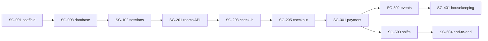

# Delivery Plan

Version 1.0 · 2026-09-30 · Owner: Tech lead

## 1. Delivery model

Three lanes, each owning directories, so several Claude Code sessions can work at once without conflicts.

| Lane | Owns | Notes |
| --- | --- | --- |
| API | `api/**` | Go backend, migrations, generated server stubs |
| WEB | `web/**` | Next.js app, generated client, mocks |
| PLAT | `contracts/**`, `.github/**`, `deploy/**`, `Makefile`, root files, `docs/**` structure | Owns shared files; lanes request changes. The tech lead reviews every contract PR |

Every cross-lane dependency is a contract, merged on day 1 of the sprint. Feature slices pair an API story with a WEB story on one contract.

## 2. Capacity model (honest numbers)

A point is roughly one hour of tech-lead review and integration effort. Writing code is not the bottleneck when AI lanes run; reviewing and integrating is.

| Item | Value | Basis |
| --- | --- | --- |
| Sprint length | 1 calendar week (5 working days) | Small team of one human |
| Focused hours per working day | about 6 | Assumption; if only evenings and weekends are available, multiply calendar time accordingly |
| Tech-lead review capacity | about 30 pts per sprint | 5 days × 6 hours |
| Buffer | 15% | Commit at most 25 pts per sprint |
| Lane throughput | API about 12, WEB about 12, PLAT about 6 pts per sprint | Steady Claude Code lane with fast turnaround on review |
| PR size | < 400 changed lines excluding generated code | Keeps review under an hour |

Total scope is 73 points over four sprints (22, 19, 19, 13). The last sprint is deliberately light to absorb slippage. The earlier informal estimate of about seven working days was made before permissions, shift reconciliation, trial tenants and internationalisation were added; this plan replaces it.

## 3. Feature slices

| Slice | Backend | Frontend | Contract (merged day 1) | Flag | Release |
| --- | --- | --- | --- | --- | --- |
| S1 Room map | SG-201 | SG-202 | listBuildings, listRooms, getRoom | `FF_S1_ROOM_MAP` | v0.0.2 |
| S2 Check-in | SG-203 | SG-204 | createStay, getStay | `FF_S2_CHECKIN` | v0.0.2 |
| S3 Extras and check-out | SG-205 | SG-206 | listServices, addStayExtras, checkoutStay | `FF_S3_CHECKOUT` | v0.0.2 |
| S4 Payments | SG-301, SG-302 | SG-303 | createPayment, getPayment, streamPaymentEvents, simulatePaymentReceived | `FF_S4_PAYMENTS` | v0.0.3 |
| S5 Housekeeping | SG-401 | SG-402 | listHousekeepingTasks, completeHousekeepingTask, reportRoomUsage | `FF_S5_HOUSEKEEPING` | v0.0.3 |
| S6 Owner overview | SG-403 | SG-404 | getOwnerOverview | `FF_S6_OWNER` | v0.0.3 |
| S7 Permissions | SG-501 | SG-502 | listStaffPermissions, setBuildingPermission | `FF_S7_PERMISSIONS` | v0.0.3 |
| S8 Shifts | SG-503 | SG-504 | getCurrentShift, recordCashPayout, closeShift, getShiftReview | `FF_S8_SHIFTS` | v0.1.0 |
| S9 Trials and roles | SG-601 | SG-602 | createDemoSession (trial behaviour) | `FF_S9_TRIALS` | v0.1.0 |

Both sides merge behind the flag; the flag turns on after the integration checkpoint; flags are removed one release later. Stories outside slices: SG-001, SG-002, SG-003, SG-004, SG-101, SG-102, SG-603, SG-604.

## 4. Sprint plan

`A ∥ B` means concurrent; `A → B` means sequence.

| Sprint | Goal | Wave 1 | Wave 2 | Wave 3 | Points | Release |
| --- | --- | --- | --- | --- | --- | --- |
| 0 | Foundations and the pricing core | SG-001 | SG-002 ∥ SG-003 ∥ SG-004 ∥ SG-101 | SG-102 ∥ SG-202 | 22 | v0.0.1 |
| 1 | Front-desk loop up to payment creation | SG-204 ∥ SG-206 ∥ SG-303 ∥ SG-201 | SG-203 | SG-205 → SG-301 | 19 | v0.0.2 |
| 2 | Payment confirmation, housekeeping, owner, permissions, packaging | SG-302 ∥ SG-501 ∥ SG-603 ∥ SG-402 ∥ SG-404 ∥ SG-502 | SG-401 ∥ SG-403 | none | 19 | v0.0.3 |
| 3 | Shifts, trials, end-to-end and public release | SG-503 ∥ SG-504 ∥ SG-601 ∥ SG-602 | SG-604 | none | 13 | v0.1.0 |

Points per sprint: Sprint 0 has 22 (SG-001 3, SG-002 3, SG-003 3, SG-004 2, SG-101 5, SG-102 3, SG-202 3); Sprint 1 has 19 (SG-201 2, SG-203 3, SG-204 2, SG-205 3, SG-206 3, SG-301 3, SG-303 3); Sprint 2 has 19 (SG-302 3, SG-401 2, SG-402 2, SG-403 2, SG-404 2, SG-501 3, SG-502 2, SG-603 3); Sprint 3 has 13 (SG-503 3, SG-504 3, SG-601 3, SG-602 2, SG-604 2). All are within the 25-point commitment.

Lane load per sprint (points): Sprint 0 API 11, WEB 5, PLAT 6; Sprint 1 API 11, WEB 8; Sprint 2 API 10, WEB 6, PLAT 3; Sprint 3 API 6, WEB 5, PLAT 2. No lane exceeds its throughput.

## 5. Dependency graph and critical path



Critical path: SG-001 → SG-003 → SG-102 → SG-201 → SG-203 → SG-205 → SG-301 → SG-302 → SG-503 → SG-604. Protect it: first review slot each day, no scope added to it mid-sprint. SG-101 and all WEB stories run beside it.

## 6. Definition of Ready

- Numbered, testable acceptance criteria; lane, points, slice and dependencies set
- Contract changes identified and merged, or listed for a contract PR
- Doc sections cited (docs/02, 04, 05) and migration number reserved
- Test approach known; no blocking open question (else schedule `brainstorming`)

## 7. Definition of Done

Story: every AC proven by a named test; lint, tests and contract checks green; security scan clean; logs and metrics added; docs updated in the same PR; `docs/progress.md` updated; a release-notes entry drafted; bug log and ADR entries written where the rules in docs/11 require them; review done.
Slice: both sides merged behind the flag; integration checkpoint passed; short screen recording attached.
Release: tag; release notes complete; old flags removed; risks reviewed; for v0.1.0 the public-repository checklist (docs/11 §6) is complete.

## 8. Branching, versioning and flags

Trunk-based. Branches `feat|fix|chore/<ID>-<slug>` live at most three days. `contract/<slice>-<slug>` branches merge first. Squash merge with `type(scope): summary (<ID>)`. SemVer for the product; the API major version is in the URL; tags `v0.0.1`, `v0.0.2`, `v0.0.3`, `v0.1.0`. Flags are environment variables read once at startup.

## 9. Ceremonies (solo)

| Moment | Action |
| --- | --- |
| Sprint start | Contract PRs for the sprint's slices (playbook below); confirm capacity against docs/progress.md |
| Daily | Review queue first; update `docs/progress.md` |
| Sprint end | Integration checkpoints, tag internal release, release notes, retro notes in `docs/progress.md` |
| After each bug | Bug log entry (docs/11 §5) |

## 10. Claude Code playbook

Sprint start (tech lead, on `main`):

```
Read docs/07 §3 for Sprint <n> and its stories in docs/06. For each slice draft the contract PR
(contracts/ only). Follow CLAUDE.md §4 for the workflow. Do not touch service code.
Report in under 10 lines.
```

Lane session (one terminal per lane, after contracts merge):

```
You are the <LANE> lane. Story <ID>. Read CLAUDE.md, <service>/CLAUDE.md, the story in docs/06 and only the
doc sections it cites. Follow CLAUDE.md §4 in order. The plan in docs/plans/<ID>.md contains no code.
Edit only <service>/, docs/plans/ and the tracking files named in docs/11. If a contract change is needed,
stop and write a Ruling in the plan for the tech lead.
```

Parallel dispatch inside a story is allowed only for tasks with disjoint files; each subagent brief names the task, the files it may edit, the failing test to write first, the verification command and a return format of at most 150 words.

Integration checkpoint (tech lead):

```
Slice <S>: both sides merged. Run make up with <FLAG>=true and mocks off; run the slice journey and the
contract tests. On failure use systematic-debugging, decide which side violates the contract, open a fix
story for that lane and write a bug-log entry. Report with the last 20 lines of output only.
```

Merge order: contracts → providers → consumers → flag on.

## 11. Tracking metrics

Board columns: Backlog → Ready → In progress (per lane) → In review → Merged (flag off) → Released. Retro metrics: cross-lane conflicts (≤ 1 per sprint), WEB days blocked by API (0), review queue age (< 1 day), CI red time, escaped defects, bugs logged versus fixed. The single source of live status is `docs/progress.md`.
